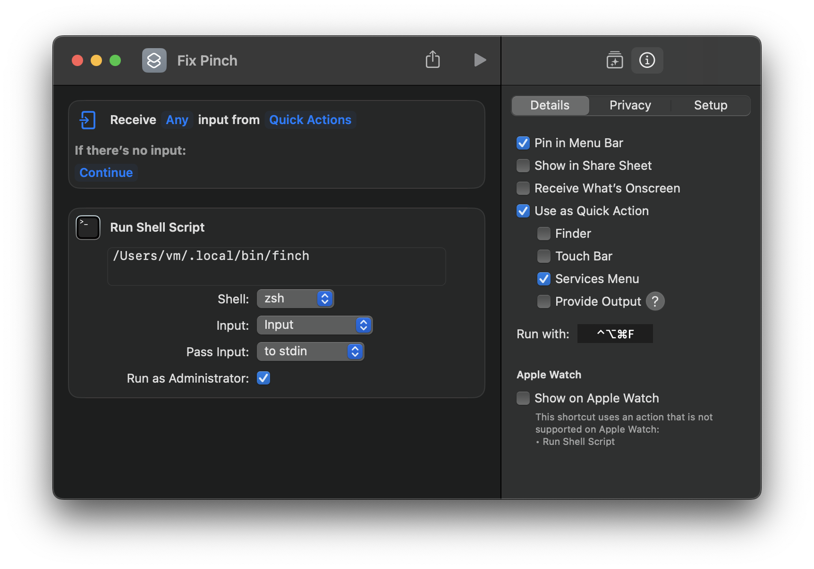

# finch

Pinch-to-zoom workaround for macOS.

## Installation

### Prerequisites

- [x] [Homebrew]
- [x] [Just]
- [x] Clang

### Build `finch`

```shell
# Clone.
gh repo clone norskeld/finch

# Install `Just`.
brew install just

# Build and create a symlink (~/.local/bin/finch).
just

# OR

# Build only (`finch.out`).
just build
```

### Shortcut



<!-- Links. -->

[just]: https://github.com/casey/just
[homebrew]: https://brew.sh
